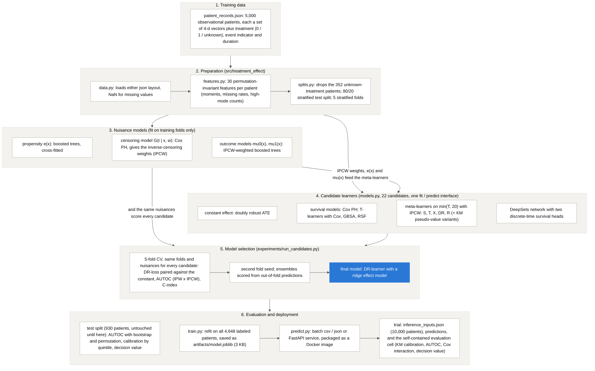

# Treatment effect prediction

Take-home project for Ataraxis. Aman Singh.

**The question.** Doctors give a treatment hoping it delays an undesirable event, but they do not know which patients actually benefit. Given a patient's embeddings (a set of 4-d vectors describing the pre-treatment disease state), predict how much the treatment helps that patient.

**The answer this project gives.** A model that returns, for each patient, the expected event-free time gained by treating within the next 20 time units (a difference in restricted mean survival time). Positive means treat. The model was selected among 22 candidates on cross-validation, checked on an untouched test split, used to score the 10,000 randomized-trial patients, and packaged in a container. On the test split, ranking patients by the prediction finds the ones who benefit far better than chance (AUTOC +1.97, 95% CI [+0.82, +3.06], one-sided permutation p = 0.003) and the predicted magnitudes are calibrated on average (slope 1.05 across quintiles).

The full story, with every written answer, the analysis and the experiments, is in [task.ipynb](task.ipynb). This file is the map.

## Architecture



The same diagram rendered as an image (with `mermaid-cli`) is [figures/00_architecture.png](figures/00_architecture.png); the notebook embeds it.

**Walkthrough, top to bottom.**

1. **Data.** Both json layouts (the record list of `patient_records.json` and the column layout of `inference_inputs.json`) load into one structure with NaN for missing values.
2. **Features.** Each patient's variable-length set of vectors becomes 30 numbers that do not depend on the order of the vectors: per-dimension moments, the number of vectors, the missing rates of dimensions 2 and 3, and counts of the vectors in the second mode of dimensions 2 and 3 (threshold 2.4, the valley in the pooled histogram).
3. **Splits.** The 352 patients without a recorded treatment are dropped from modelling (no arm, no arm-specific outcome). Of the remaining 4,648, 20% (930) are the test split, stratified on treatment × event, untouched until the report. Model selection is 5-fold cross-validation on the other 3,718.
4. **Nuisance models**, fit on training folds only: a boosted-tree propensity model, a Cox model of the censoring time (censoring depends on the features here), and IPCW-weighted boosted-tree outcome models per arm.
5. **Candidate learners**, all behind one `fit` / `predict` interface: a constant effect, Cox models, survival T-learners, S/T/X/DR/R meta-learners on the restricted outcome, and a DeepSets network.
6. **Selection.** Every candidate is scored on the same folds with the same nuisance models (DR-loss paired against the constant, AUTOC, C-index), re-checked with a second fold seed, and compared with ensembles built from the out-of-fold predictions.
7. **Evaluation and deployment.** The chosen model is evaluated once on the test split, refit on all 4,648 labeled patients, used to score the trial, and shipped as a 3 KB artifact inside a Docker image with a batch CLI and an HTTP service.

## Methodology

- **Estimand.** The conditional average treatment effect on the time scale: τ(x) = E[min(T₁, 20) − min(T₀, 20) | x], the difference in restricted mean survival time at horizon 20. It is in the units the doctors ask about, needs no proportional hazards assumption, and can be estimated in a randomized trial with Kaplan-Meier alone, so the external check does not depend on the model. Horizon 20 keeps 340 to 380 patients per arm at risk; past 25 the risk sets thin out fast.
- **Confounding.** Treated patients look worse in the raw data (69% events vs 60%), and the features predict who gets treated with AUC 0.70, so this is confounding by indication. Every model adjusts for the features; the meta-learners also use cross-fitted propensity scores (overlap is fine: 1st to 99th percentile 0.12 to 0.88, and the propensity model is calibrated by decile).
- **Censoring.** A Cox model for the *censoring* time given features and treatment reaches a C-index of 0.71, so censoring is not independent of the features. The meta-learners therefore weight each patient whose restricted outcome is observed by the inverse of their modelled probability of still being under follow-up (IPCW) instead of using Kaplan-Meier pseudo-values; the pseudo-value variants are kept in the sweep to show the difference. The survival models condition on the features and only need the weaker assumption.
- **Final model.** A DR-learner: cross-fitted propensity and outcome models and the censoring weights are combined into a doubly robust pseudo-outcome for the effect, which is regressed on the 30 features with ridge regression (penalty chosen by leave-one-out; the chosen value is interior to the grid). Double robustness covers the propensity and outcome models; the censoring model has to be right in either case.
- **Selection score.** The DR-loss (mean squared distance to a doubly robust pseudo-outcome built on the validation fold from nuisance models fit on the training folds) reported as the fold-wise difference to the constant baseline, plus the AUTOC (rank-weighted average treatment effect, Yadlowsky et al. 2021) with inverse-propensity × inverse-censoring weights, plus Harrell's C for candidates that predict per-arm outcomes. Within noise the simpler model wins.
- **Trial evaluation.** Observed against predicted effect by predicted-benefit quintile (Kaplan-Meier within bins, calibration slope), AUTOC with a bootstrap interval and a one-sided permutation p-value, a Cox treatment × score interaction test, and the decision value of three treatment rules. The notebook states what counts as poor, good and great for each.
- **Assumptions**, stated in the notebook: no unmeasured confounding given the embeddings, overlap, censoring independent of the event time given features and treatment (and adequately captured by a Cox model), consistency and no interference, trial patients drawn from the same population (a classifier cannot tell them apart, AUC 0.50), and a stable effect over time.

## Results

Cross-validation on the development split (5 folds, seed 0; DR-loss as the mean fold-wise difference to the constant baseline, negative is better; AUTOC in time units):

| candidate | DR-loss vs constant | folds better | AUTOC |
|---|---|---|---|
| DR-learner, ridge effect (**final**) | −3.19 ± 0.88 | 5 / 5 | 1.91 ± 0.41 |
| R-learner, ridge effect | −2.72 ± 0.43 | 5 / 5 | 1.83 ± 0.38 |
| DR-learner, boosted-survival nuisances | −2.44 ± 0.49 | 5 / 5 | 1.61 ± 0.36 |
| S-learner, boosted trees (IPCW) | −2.18 ± 0.63 | 5 / 5 | 1.64 ± 0.27 |
| S-learner, ridge with interactions | −2.07 ± 0.44 | 5 / 5 | 1.62 ± 0.34 |
| DeepSets network + features | −1.21 ± 0.53 | 5 / 5 | 1.33 ± 0.54 |
| DR-learner, ridge, KM pseudo-values (no censoring model) | −0.46 ± 0.47 | 3 / 5 | 0.94 ± 0.22 |
| constant effect | 0 | – | 0.06 ± 0.30 |
| DR-learner, deeper boosted trees | +7.13 ± 0.99 | 0 / 5 | 1.10 ± 0.23 |

The full table (22 candidates), the second-seed rerun and the ensemble comparison are in section 2 of the notebook and in `experiments/results/`. With a second fold seed the same six candidates beat the constant again and the DR-learner stays on top (3.2 below the constant on both seeds, the R-learner within noise of it); averaging it with the boosted S-learner gains about 0.1, inside one standard error, so the single ridge model is kept.

Test split (930 patients the model never saw; nuisance models fit on the development split):

| check | value |
|---|---|
| AUTOC, IPW × IPCW | +1.97, 95% bootstrap CI [+0.82, +3.06], one-sided permutation p = 0.003 |
| calibration slope, observed on predicted across quintiles | 1.05 (top quintile: observed +5.4 [+2.7, +8.1] vs predicted +3.2) |
| DR-loss vs constant | −1.9, 95% CI [−6.9, +2.9] (the pseudo-outcome has sd 22, so this needs thousands of patients) |
| adjusted average effect (development split) | +0.90 time units within 20, se 0.36; 75% of patients predicted to benefit |
| outcome models, Harrell's C | 0.54 (control), 0.55 (treated): the embeddings barely predict the outcome itself |
| decision value (expected event-free time within 20) | treat nobody 10.00, treat everybody 11.02, treat if the model says > 0 (75% of patients) 11.08; gain over the better uniform rule +0.06 [−0.59, +0.66] |

## Key findings

- **The effect is real but the outcome signal is weak.** Harrell's C for the outcome is barely above 0.5, yet the ranking by predicted benefit is clearly better than chance. The effect rides on a few coarse features: the overall level of dimensions 0, 1 and 2 (more benefit), the missing rate of dimension 2 (less benefit) and the level of the high-mode vectors in dimension 2 (more benefit).
- **Simple beats flexible.** Every effect model built from boosted trees or forests was no better than a constant within noise, and the deeper ones were worse; ridge on 30 features won on both criteria. The chosen ridge penalty is large (about 5,600 on standardised features).
- **The censoring model is not optional.** Replacing the IPCW weights with Kaplan-Meier pseudo-values cuts the DR-learner's gain over the constant from 3.2 to 0.5 and the AUTOC from 1.91 to 0.94, and moves the adjusted average effect from about zero to +0.8.
- **Missingness is informative.** The share of missing values per patient predicts both treatment (70% treated in the most complete quartile vs 24% in the least complete) and follow-up time; it is a feature, not a nuisance.
- **The predictions are compressed at the extremes.** The AUTOC exceeds what the model's own spread would produce if its predictions were exactly right, and the top quintile's observed effect is larger than predicted: the ridge penalty shrinks the tails. Fine for ranking, worth knowing when quoting numbers.
- **Trial patients look like training patients**, in the features (AUC 0.50) and in the model's output space, and trial treatment is unrelated to the features (AUC 0.52), as randomization promises.

## Figures

All figures are produced by the notebook and exported to `figures/`:

| file | what it shows |
|---|---|
| 00_architecture | the workflow above |
| 01_missingness_is_informative | treated share and event-free curves by missing-value quartile |
| 02_embedding_dimensions | pooled distribution of the four dimensions, with the high-mode threshold |
| 03_kaplan_meier_by_arm_and_censoring | raw event-free and censoring curves by arm |
| 04_propensity_overlap_and_calibration | overlap of propensity scores and their calibration by decile |
| 05_heterogeneity_check | raw Kaplan-Meier by arm below and above the median of the strongest interaction feature |
| 06_candidate_sweep_dr_loss_and_autoc | all 22 candidates on both selection criteria, final model highlighted |
| 07_candidate_agreement_heatmap | correlation between the top candidates' out-of-fold predictions |
| 08_test_split_calibration_and_toc | observed vs predicted effect by quintile; TOC curve against the random-ranking band |
| 09_test_split_predictions_and_weights | distribution of predictions; IPW × IPCW weights with the effective sample size |
| 10_decision_value | expected event-free time under three treatment rules |
| 11_effect_model_coefficients | the ridge effect model's largest coefficients |
| 12_predicted_effect_by_feature_decile | mean prediction by decile of the three strongest features |
| 13_predictions_training_vs_trial | predicted effects for training and trial patients |
| 14_trial_evaluation_on_fake_outcomes | the evaluation cell's output on the placeholder outcomes (null by design) |

## Repository layout

```
task.ipynb                    the notebook: sections 1-5 of the assignment with all written answers
src/treatment_effect/
    data.py                   loads the json files in either layout
    features.py               set of 4-d vectors -> 30 permutation-invariant features
    models.py                 every learner that was tried, the registry, the deployable wrapper
    metrics.py                Kaplan-Meier, RMST, IPCW, pseudo-values, AUTOC, calibration, DR-loss
    splits.py                 the dev/test split and the CV folds
    train.py                  python -m treatment_effect.train  -> artifacts/model.joblib
    predict.py                python -m treatment_effect.predict (batch csv/json, or an HTTP service)
experiments/
    run_candidates.py         the cross-validation sweep over all candidates
    analysis.py               reading the results back, ensembles from out-of-fold predictions
    results/                  fold-level results, summaries, out-of-fold predictions and nuisances
                              (*_firstpass_kmpv.* is the first sweep, scored with KM pseudo-values;
                               *_seed1.* the second-seed rerun of the top candidates)
predictions/                  the 10,000 trial predictions (csv and json)
artifacts/model.joblib        the final model (+ model.json describing it)
docker/                       Dockerfile and runtime requirements
figures/                      the figures listed above
tests/                        pytest checks: loading, features, metrics, censoring weights, save/load
data/                         the three json files from the assignment (not in the repository; copy them here)
```

## How to run

Python 3.11. All commands assume the project root as the working directory. The assignment's data files are not in the repository: place `patient_records.json`, `inference_inputs.json` and `fake_inference_outcomes.json` in `data/` first.

```
python -m venv .venv && source .venv/bin/activate
pip install -r requirements.txt
pytest -q                                           # 9 quick checks
jupyter nbconvert --to notebook --execute --inplace task.ipynb   # about 2 minutes; or open it in Jupyter
```

The notebook loads the saved experiment results by default. Setting `RUN_EXPERIMENTS = True` in section 2 re-runs the sweep (about 25 minutes on a laptop; the second-seed rerun is another 6):

```
python experiments/run_candidates.py                     # 22 candidates x 5 folds
python experiments/run_candidates.py --seed 1 --tag seed1 --only dr_learner_ridge,r_learner_ridge
```

Train and predict outside the notebook:

```
PYTHONPATH=src python -m treatment_effect.train --data data/patient_records.json --out artifacts/model.joblib
PYTHONPATH=src python -m treatment_effect.predict --model artifacts/model.joblib \
    --input data/inference_inputs.json --output predictions/inference_predictions.csv
```

The input can be a list of patient records, the column layout of `inference_inputs.json`, or a single record; outcomes and treatment are not needed to predict. Output columns: `patient_id`, `predicted_effect`.

Docker:

```
docker build -t treatment-effect -f docker/Dockerfile .

# batch: mount a folder with the input json, predictions land next to it
docker run --rm -v "$PWD/data:/data" treatment-effect \
    --input /data/inference_inputs.json --output /data/predictions.csv

# service
docker run --rm -p 8000:8000 treatment-effect serve
curl localhost:8000/health
curl -X POST localhost:8000/predict -H 'content-type: application/json' --data-binary @patients.json
```

The image holds the inference code and the saved model with numpy, pandas, scipy, scikit-learn, FastAPI and uvicorn pinned to the training versions. scikit-survival and torch are only needed to train, so they are not in it, and the build fails if the model does not load.

## Evaluating on the real trial outcomes

Open `task.ipynb`, go to the evaluation cell at the end of section 4, set `OUTCOMES_PATH` to the real outcomes file and run the cell. It is self-contained and prints the calibration table by predicted-benefit quintile, the AUTOC with its interval and permutation p-value, the Cox interaction test and the decision value of three treatment rules, with the thresholds for poor / good / great explained right below it. It accepts the outcomes in the layout of `fake_inference_outcomes.json` or as a list of records, with or without a `treatment` column.

## Reproducibility

Seeds are fixed in the code (test split 42, folds 0 and 1, learners 0). Numbers quoted above come from the saved results in `experiments/results/` and from executing the notebook on a laptop (Apple M2, 8 GB); the sweep takes about 25 minutes, the notebook about 2.
